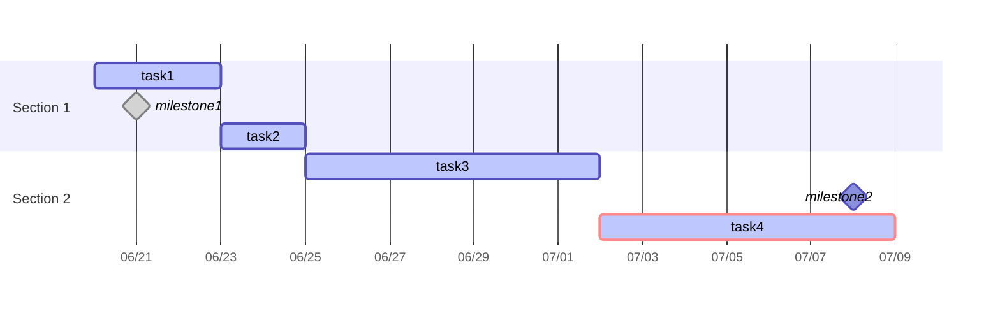

做项目管理时，甘特图是一种可视化项目和任务进度的优秀工具。但是手工绘制甘特图十分繁琐，而专门的项目管理软件有时又略显复杂。Obsidian原生支持的Mermaid可视化图表提供了一个甘特图的图表选项，让我们能通过代码快速生成一个简要的甘特图，可以满足相对简单项目的进度管理或管理大项目的分解项目。

然而，记忆Mermaid甘特图的语法有些困难，修改也比较费时，代码的方式对普通人来说还是太反直觉了。因此，我让AI帮我做了这个小工具。用于将tasks插件格式的任务快速转化成mermaid甘特图代码。实现一键生图的效果。

主要功能、使用方法、注意事项、范例如下：

## 主要功能：

1. **任务解析**：自动从 `## 项目分解` 标题下提取任务信息
2. **支持Tasks插件任务属性**：
    - 开始日期 🛫
    - 截止日期 📅
    - 任务ID 🆔
    - 依赖关系 ⛔
    - 高优先级标记 🔺
    - 完成状态 [x]
3. **里程碑标记**：通过Dataview内链，用[keyword::@milestone]格式标记
4. **智能日期处理**：自动计算任务持续时间
5. **灵活插入选项**：
	- **cursor** - 在光标位置插入（默认）
	- **append** - 追加到文件末尾
	- **replace** - 替换现有甘特图
	- **copy** - 复制到剪贴板

## 使用方法：

1. 将代码`convertToMermaidGantt.js`保存到笔记库任意文件夹
2. 在 Obsidian 中安装 QuickAdd 插件
3. 在QuickAdd插件中添加新的宏，选择刚刚保存的脚本文件
4. 在包含任务的笔记中运行宏
5. 选择甘特图插入方式，默认cursor（在光标位置插入）
6. 任务更新时重新运行命令，将curesor替换为replace，即可刷新甘特图

## 注意事项：

- 确保任务格式正确，特别是日期格式（YYYY-MM-DD）
- 脚本会自动识别三级标题作为甘特图的 section
- 里程碑任务持续时间自动设为 0d
- 支持任务依赖关系的可视化
- 目前只识别Tasks插件的 `task表情格式`，请勿使用 `Dataview格式`
- 通过Tasks插件生成甘特图关联的项目如下👇

![[../990 Attachments/【脚本说明】基于任务生成甘特图/bb884e5a98a76cece1cda34aa184c0a0_MD5.png]]

## 范例：
- **注意**：甘特图相关任务必须放在二级标题 `## 项目分解` 中，二级标题的名称不能更改。如要修改，需要调整源代码。

---

## 项目分解

### Section 1
- [ ] task1 🛫 2025-06-20 📅 2025-06-23 🆔 nkf49w #exclude
- [x] milestone1 📅 2025-06-21 [keyword::@milestone] #exclude
- [ ] task2 📅 2025-06-25 ⛔ nkf49w #exclude

### Section 2
- [ ] task3 🛫 2025-06-25 📅 2025-07-02  🆔 p9etar #exclude
- [ ] milestone2 📅 2025-07-08 [keyword::@milestone] #exclude
- [ ] task4  📅 2025-07-09 🔺 ⛔ p9etar #exclude

## 甘特图

如果喜欢这篇文章，欢迎点赞👍、关注🧡、留言☺️~

---

脚本文件：
- 在用版本，弹框选择是否含周末：[[convertToMermaidGantt.js]]
- 计工作日天数，显示周末：[[convertToMermaidGantt-excludeWeekend.js]]
- 计自然日天数，不显示周末：[[convertToMermaidGantt-includeWeekend.js]]