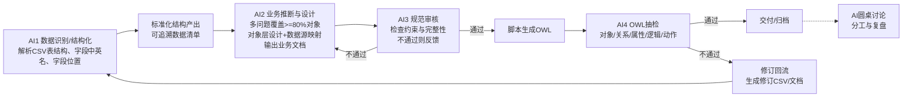
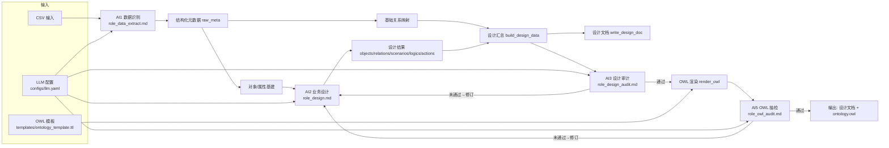

```mermaid
flowchart LR
    A[AI1 数据识别/结构化\n解析CSV表结构、字段中英名、字段位置] --> B[标准化结构产出\n可追溯数据清单]
    B --> C[AI2 业务推断与设计\n多问题覆盖>=80%对象\n对象层设计+数据源映射\n输出业务文档]
    C --> D[AI3 规范审核\n检查约束与完整性\n不通过则反馈]
    D -- 通过 --> E[脚本生成OWL]
    D -- 不通过 --> C
    E --> F[AI4 OWL抽检\n对象/关系/属性/逻辑/动作]
    F -- 通过 --> G[交付/归档]
    F -- 不通过 --> H[修订回流\n生成修订CSV/文档]
    H --> A
    G -.-> I[AI圆桌讨论\n分工与复盘]

```

```mermaid
flowchart LR
  subgraph 输入
    A[CSV 输入]
    T[OWL 模板<br/>templates/ontology_template.ttl]
    Cfg[LLM 配置<br/>configs/llm.yaml]
  end

  A --> B[AI1 数据识别<br/>role_data_extract.md]
  Cfg --> B
  B --> R[结构化元数据 raw_meta]

  R --> D[对象/属性基建]
  R --> E[基础关系映射]

  D --> F[AI2 业务设计<br/>role_design.md]
  Cfg --> F
  F --> G[设计结果 objects/relations/scenarios/logics/actions]

  E --> H[设计汇总 build_design_data]
  G --> H

  H --> I[设计文档 write_design_doc]
  H --> J[AI3 设计审计<br/>role_design_audit.md]
  Cfg --> J
  J -->|未通过→修订| F
  J -->|通过| K[OWL 渲染 render_owl]
  T --> K

  K --> L[AI5 OWL 抽检<br/>role_owl_audit.md]
  Cfg --> L
  L -->|未通过→修订| F
  L -->|通过| M[输出: 设计文档 + ontology.owl]

```
AI1（数据抽取）负责把原始CSV内容初步结构化成“原始元数据(raw_meta)

