# 面试问答整理

> ⚡ **每题 15 秒说完结论**，图表下方标注「面试说」是口语版，直接背。

---

## 🧬 个人画像

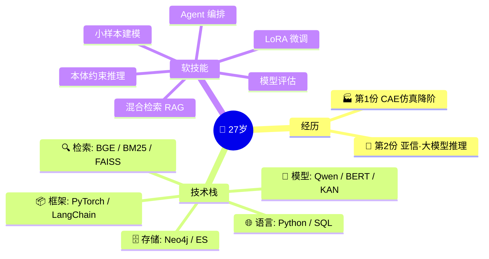

| | ⚙️ 核心能力 | 📊 技术栈比例 |
|--|------------|-------------|
| **🎯 定位** | 领域知识驱动的 ML 工程师<br/>物理约束 → 业务规则 → 模型推理 | ```pie title 技术栈构成<br/>"Python/PyTorch" : 25<br/>"LangChain/Agent" : 25<br/>"RAG/检索(BGE+BM25)" : 20<br/>"Neo4j/本体" : 15<br/>"KAN/小样本" : 10<br/>"LoRA/微调" : 5``` |
| **🧩 差异点** | 不是纯调模型，而是把<br/>**领域规则写进推理流程** | |
| **💡 一句话定位** | 「用ML替代物理仿真 → 用本体约束大模型推理」<br/>底层一贯：**领域知识嵌入模型推理** | |

---

## 🗺️ 职业生涯全景图

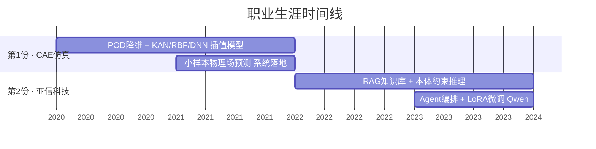

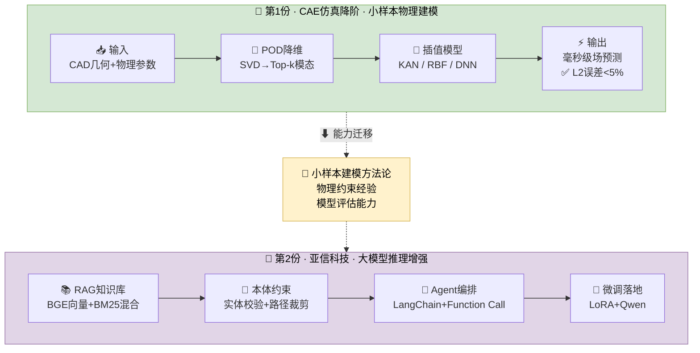

> 💬 **面试说**：我两段经历，前一段做CAE仿真降阶（POD+KAN把有限元仿真加速百倍），后一段在亚信做基于本体约束的大模型推理（RAG+Agent+LoRA），底层都是把领域知识嵌入模型推理。

---

## 🔗 主线故事

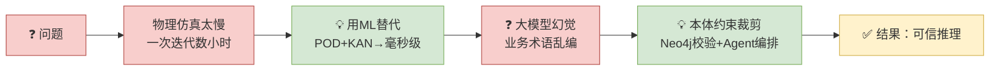

> 💬 **面试说**：我的技术路线是从 "用ML加速物理仿真" 到 "用本体约束大模型推理" —— 核心没变：把领域知识嵌入到模型推理里。

---

## 1. 自我介绍与工作经历

### 🗣️ 面试问答

| 提问 | ✅ 一句话回答（结合个人经历，直接背） |
|------|------------------------------------|
| **请你做一下自我介绍** | 两段工作：第一份**CAE仿真降阶**（POD+KAN替代有限元，百倍加速），第二份**亚信**做本体约束推理（RAG+Agent+LoRA微调）。 |
| **简短介绍** | 物理仿真ML → 大模型推理增强。**核心**：领域知识嵌入模型。 |
| **第一份做什么** | CAE降阶系统：CAD+参数→POD压缩→KAN/RBF/DNN插值预测，替代有限元，**速度提升100倍**。 |
| **第一份最难的是什么** | ①**样本极少**（<100组）②**物理约束不能丢** ③KAN新架构，无成熟范式，踩坑多。 |
| **第二份做什么** | 本体约束推理：RAG（BGE+BM25）+ Neo4j校验 + LangChain Agent + LoRA微调Qwen。 |
| **第二份最难的是什么** | ①业务术语**幻觉率高**，靠本体路径裁剪 ②RAG带偏，**三级校验**（检索→重排→本体）③复杂推理需状态管理，LC链式不够用。 |
| **你在训练里起什么作用** | LoRA方案设计 → 指标制定（Recall/NDCG） → bad case分析 → 迭代。 |
| **新业务技术选型** | 四步：数据量→标注→实时→复杂度 → 简单BERT、检索RAG、复杂推理LLM+Agent。 |
| **模型/Agent怎么选** | **模型**：C-Eval/MMLU + 参数量 + 中文 + 成本。**Agent**：任务复杂度（线性→LC，循环→LG）+ 工具量。 |

---

## 2. CAE仿真与第一份工作

### 🏗️ 系统架构

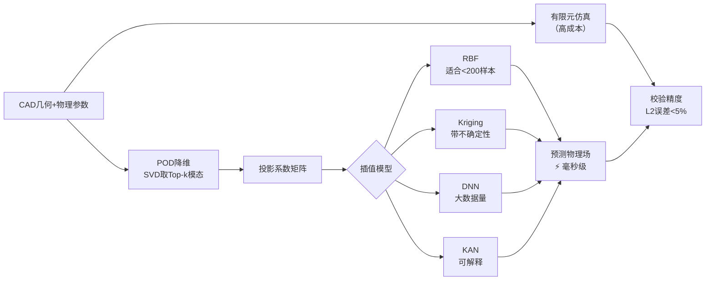

### 🗣️ 问答

| 提问 | 一句话回答 |
|------|----------|
| **CAE输入是什么** | CAD几何模型 + 边界条件 + 材料参数，离散成网格节点坐标和物理量。 |
| **精度怎么衡量** | 预测场与FEM真实场的 **相对L2误差**，要求 <5%。 |
| **POD降维怎么做** | 样本矩阵SVD → 取前k个模态基 → 高维场投影到低维系数，**降维率 >100倍**。 |
| **RBF/Kriging/DNN/KAN怎么选** | 样本<200 → Kriging（含UQ）；中等 → RBF（快）；大量+非线性 → DNN；要可解释 → KAN。 |
| **小样本怎么优化** | ①物理增强（几何变形/加噪）②迁移学习 ③KAN省参易收敛。 |
| **新数据效果下降怎么办** | MMD/KS检测分布偏移 → 增量微调或旧模型做 weight ensemble。 |

---

## 3. KAN算法

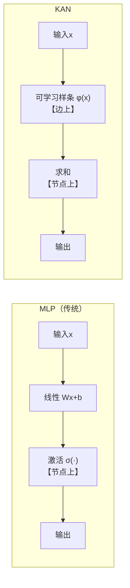

| 提问 | 一句话回答 |
|------|----------|
| **KAN是什么** | Kolmogorov-Arnold Network，**激活函数移到边上**，每个边是可学习的B样条函数。 |
| **和传统NN区别** | MLP：节点激活→边线性；KAN：边样条→节点求和。**参数更少、更可解释**。 |
| **KAN在项目中怎么用** | 替代DNN做POD系数→物理场插值，小样本拟合更好，样条曲线可直接解读物理趋势。 |
| **KAN vs BERT** | 完全无关：KAN是函数拟合网络架构，BERT是Transformer文本编码器。 |

---

## 4. 大模型与Transformer

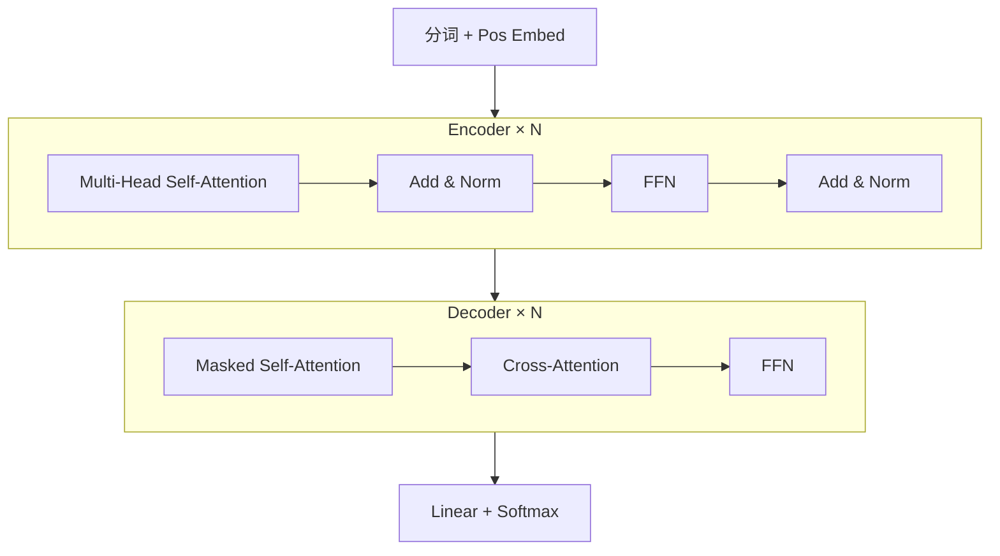

| 提问 | 一句话回答 |
|------|----------|
| **Transformer结构** | Encoder-Decoder，核心：**Multi-Head Attention + FFN**，位置编码处理序列。 |
| **自注意力机制** | **QKV映射** → 每对token注意力权重 → 加权求和得上下文表示，复杂度O(n²)。 |
| **Qwen架构特点** | Decoder-only + **RoPE** + SwiGLU + RMSNorm + **GQA**分组注意力。 |
| **BERT文本分类** | BERT编码 → 取 [CLS] → Linear头 → CrossEntropy微调。 |
| **BERT分类评估** | Accuracy / Precision-Recall-F1 / Confusion Matrix / AUC-ROC。 |

---

## 5. 大模型微调与训练

### LoRA 原理

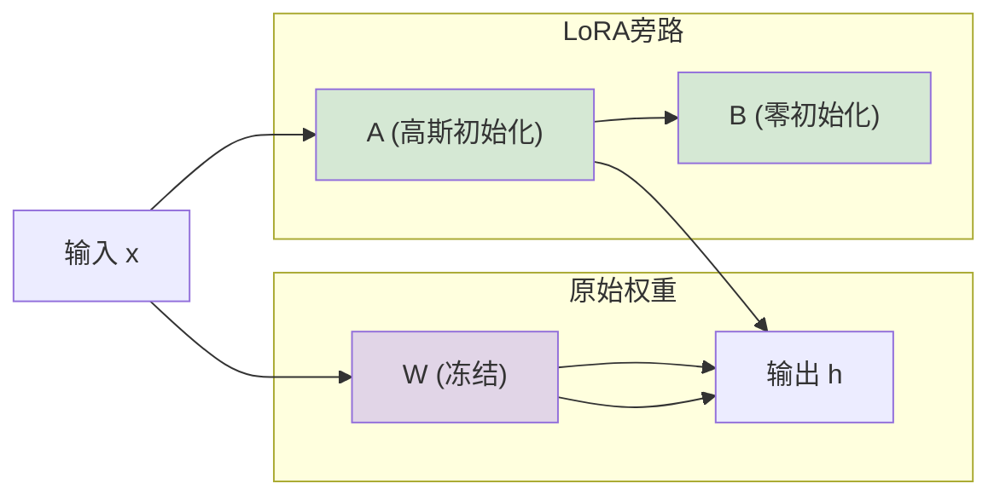

### 💾 显存速算

```
参数 1B = 1GB

SGD → 参 + 梯 + 动量 ≈ 3GB + 激活
Adam → 参 + 梯 + 一阶/二阶 ≈ 4GB + 激活
LoRA → 原参冻结 + 旁路(1%) + 激活 → 大幅节省
```

### 🗣️ 问答

| 提问 | 一句话回答 |
|------|----------|
| **LoRA是什么** | 低秩适配：权重旁路插A×B(r=8~64)，**只训旁路**，显存降至1/3。 |
| **LoRA初始化** | A高斯 → B零，保证训练开始时旁路输出=0，不破坏原模型。 |
| **训练步骤** | 前向→loss→反向→更新→验证→调参。 |
| **Adam vs SGD显存** | SGD存动量+1×参；Adam存一阶+二阶+**2×参**。 |
| **分类Loss** | 二分类→BCE，多分类→CE，多标签→BCEWithLogits，对比→InfoNCE。 |
| **PyTorch自动求导** | DAG计算图，前向记录op，反向autograd链式法则。 |

---

## 6. RAG与知识库

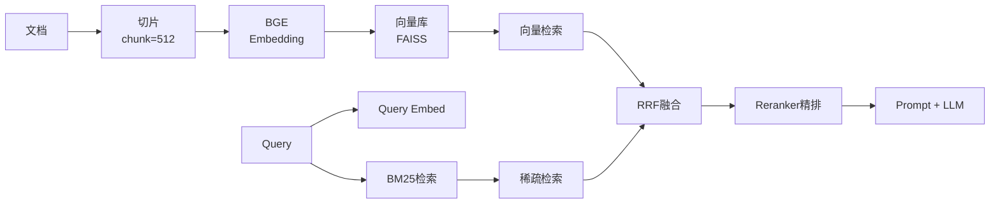

| 提问 | 一句话回答 |
|------|----------|
| **文档怎么切片** | RecursiveCharacterTextSplitter，按**段落边界**切，chunk=512~1024，overlap=10~20%。 |
| **RAG整体方案** | 文档→切片→向量化→建库 → query→检索→rerank→拼prompt→LLM生成。 |
| **召回质量怎么评估** | **Recall@k / MRR / NDCG@k** + 人工标注。 |
| **片段带偏怎么办** | cross-encoder reranker + 负反馈 + 多路交叉验证。 |

---

## 7. 检索与向量

| 提问 | 一句话回答 |
|------|----------|
| **BM25是什么** | TF-IDF + 文档长度归一化的**精确关键词**排序函数。 |
| **稀疏 vs 密集向量** | **稀疏**：词表维度，精确匹配好；**密集**：固定768维，语义匹配好。 |
| **怎么处理两种向量** | 双路召回 → score norm → **RRF融合**，根据query类型动态调权。 |
| **RRF公式** | score = Σ 1/(k + rank_i)，k=60，按排名位置加权，无分量纲。 |
| **DFS vs BFS** | DFS深度优先（**栈**，一条路到底），BFS广度优先（**队列**，逐层展开）。 |

---

## 8. Agent与多Agent

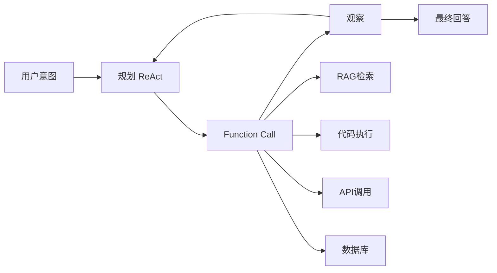

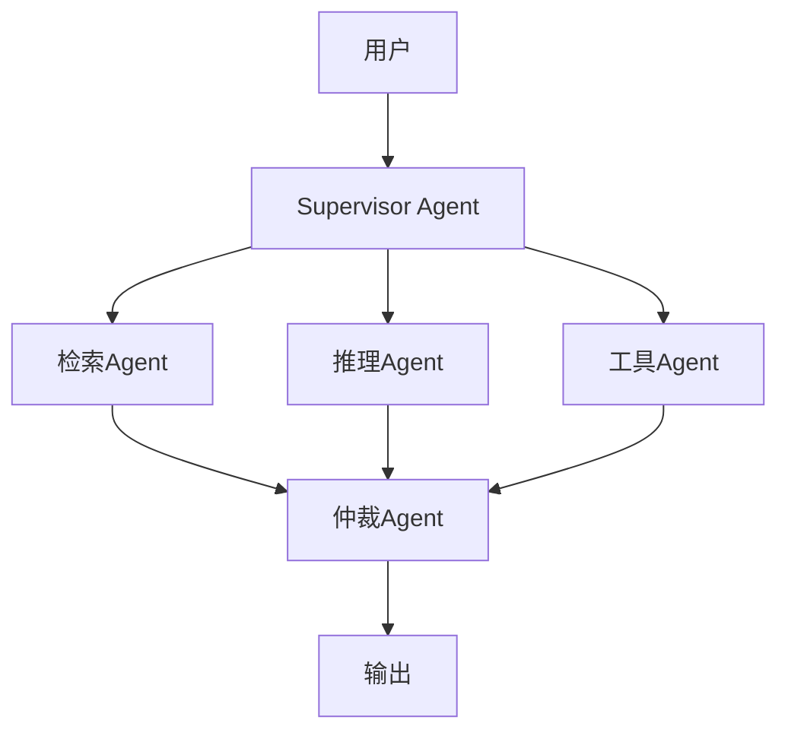

| 提问 | 一句话回答 |
|------|----------|
| **Agent干什么** | 让LLM **感知→规划→行动→观察** 循环，自主调用工具完成任务。 |
| **多Agent怎么设计** | Supervisor分派 → Specialist执行 → Arbiter合并。 |
| **Function Call流程** | LLM识别意图 → 输出tool_call → 执行→结果→回复。 |
| **工具太多怎么办** | 分组归类 + 描述写细 + router agent先选类再选具体工具。 |
| **LC vs LG** | LC线性链；LG**状态图**，支持循环/分支/回溯，适合复杂决策。 |
| **长短记忆** | 短：滑动窗口；长：向量化 + 检索 + 摘要压缩。 |

---

## 9. 本体与知识图谱

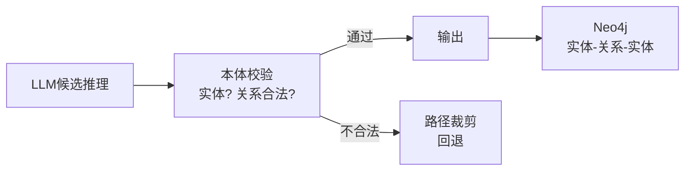

| 提问 | 一句话回答 |
|------|----------|
| **本体在亚信做什么** | OWL/Neo4j定义实体关系，做**推理路径裁剪 + 幻觉校验**。 |
| **怎么减少幻觉** | LLM生成 → 本体校验（实体/关系白名单）→ 不合规裁剪→通过输出。 |
| **Neo4j查询** | `MATCH (n:实体)-[r:关系]->(m) WHERE n.name='xx' RETURN m` |
| **关系校验怎么做** | 维护**三元组白名单** (head-rel-tail)，每步检查是否在白名单。 |

---

## 10. 多模态与视觉 ⚠️ 扩展知识（非项目经历）

> 以下我没有直接项目经验，属于面试覆盖知识，了解原理即可。

| 提问 | 一句话回答 |
|------|----------|
| **多模态融合是什么** | 文本+图像映射到统一语义空间，cross-attention或token拼接融合。 |
| **图像怎么输入LLM** | ViT编码 → patch embedding → projector → 和文本token拼接。 |
| **人脸识别框架** | InsightFace + ArcFace loss，ResNet backbone。 |
| **SAM是什么** | Meta零样本分割模型，输入点/框即可分割任意物体。 |

---

## 📌 面试应答策略

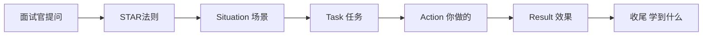

| 原则 | 说明 |
|------|------|
| **先给结论** | 一句话回答是什么/怎么做，追问再展开。 |
| **用数字说话** | 精度<5%、速度100×、显存1/3、召回+8%。 |
| **贴项目讲** | 每句话落到"我在XX项目做了XX，效果是XX"。 |
| **不熟悉的主动说** | "这个我没有直接项目经验，我对原理的了解是…" → 诚实且专业。 |

---

*最后更新：2026-06-25 | 按模块记忆，回答栏当口语背熟即可。*
