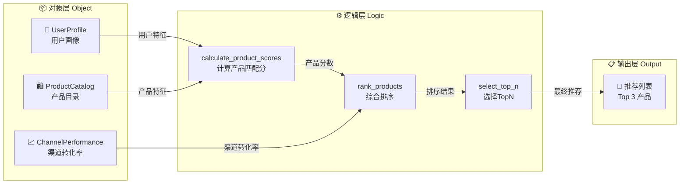
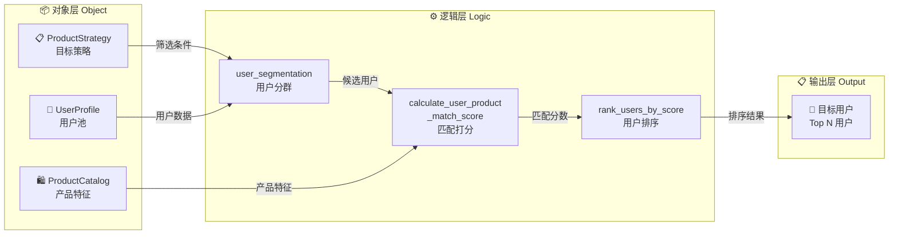
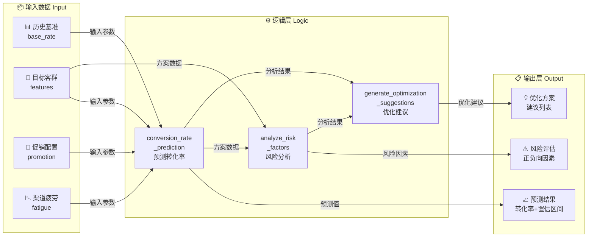

# 江西收入本体 - 三大应用场景设计

  

## 场景概览

  

本文档设计了三个不同视角的业务场景，全面展示智慧大脑AI代理的推荐能力：

  

1. **人到产品** - 用户精准推荐（User-to-Product）

2. **产品到人** - 产品目标用户筛选（Product-to-User）  

3. **方案转化率预测** - 营销效果评估（Campaign Conversion Prediction）

  

---

  

## 场景1：人到产品 - 用户精准推荐

  

### 业务目标

给定一个用户ID，基于用户画像和偏好，推荐最适合该用户的TOP 3产品。

  

### 场景描述

  

*   **[指令] (Input - System Trigger)**:

    > "用户 `user_id: 88001234` 刚刚打开了APP的个性化推荐位，请为该用户推荐最适合的3个产品套餐。"

  

*   **[解析] (Parsing)**:

    *   `AI-Agent`: 收到用户个性化推荐请求。

    *   `识别上下文`:

        *   **[对象: UserProfile]**: `user_id: 88001234`

        *   **[对象: UserPreference]**: 查询该用户的产品偏好数据

        *   **[对象: UserScoringFeatures]**: ARPU值、流量饱和度、在网时长等

        *   **[对象: Channel]**: `channel_id: 'APP_HOME_BANNER'` (APP首页推荐位)

    *   `任务目标`: 计算该用户对所有候选产品的匹配分数，结合渠道效果，返回TOP 3推荐。

  

*   **[执行流] (Execution Flow)**:

    1.  **调用 [动作: QueryUserContext]**

        *   `AI-Agent`: "首先获取用户88001234的完整画像和偏好特征。"

        *   `输入`: `user_id: 88001234`

        *   `输出`:

            *   `UserProfile`: {年龄段: 25-35岁, 性别: 男, 在网时长: 36个月}

            *   `UserPreference`: {影视偏好: 0.85, 游戏偏好: 0.92, 阅读偏好: 0.35, ...}

            *   `UserScoringFeatures`: {ARPU: 78元, 流量饱和度: 92%, 通话时长: 120分钟/月}

  

    2.  **调用 [动作: QueryScores]**

        *   `AI-Agent`: "计算用户对各产品的匹配分数和渠道效果分。"

        *   `输入`: `user_id: 88001234`, `channel_id: 'APP_HOME_BANNER'`

        *   `处理逻辑`:

            *   基于 **[逻辑: calculate_product_scores]** 计算产品匹配度

            *   基于 **[逻辑: calculate_channel_score]** 计算渠道效果分

        *   `输出`:

            *   `Product_Scores`: `[(游戏畅玩套餐, 0.92), (视频会员套餐, 0.85), (流量王套餐, 0.68), (阅读套餐, 0.35)]`

            *   `Channel_Score`: `0.88` (APP渠道对该用户的历史转化效果)

  

    3.  **调用 [动作: Rank]**

        *   `AI-Agent`: "应用加权排序逻辑，计算最终推荐分数。"

        *   `输入`: `Product_Scores`, `Channel_Score`

        *   `处理逻辑`: **[逻辑]** `最终分 = (产品匹配分 × 0.7) + (渠道效果分 × 0.3)`

            *   `游戏畅玩套餐`: (0.92 × 0.7) + (0.88 × 0.3) = 0.644 + 0.264 = **0.908**

            *   `视频会员套餐`: (0.85 × 0.7) + (0.88 × 0.3) = 0.595 + 0.264 = **0.859**

            *   `流量王套餐`: (0.68 × 0.7) + (0.88 × 0.3) = 0.476 + 0.264 = **0.740**

            *   `阅读套餐`: (0.35 × 0.7) + (0.88 × 0.3) = 0.245 + 0.264 = **0.509**

        *   `输出`: **[排序列表]** `Ranked_Products: [(游戏畅玩套餐, 0.908), (视频会员套餐, 0.859), (流量王套餐, 0.740), ...]`

  

    4.  **调用 [动作: SelectTopN]**

        *   `AI-Agent`: "选取TOP 3产品作为推荐结果。"

        *   `输入`: `Ranked_Products`, `N=3`

        *   `输出`: **[推荐列表]** `['游戏畅玩套餐', '视频会员套餐', '流量王套餐']`

  

*   **[响应] (Output - API Response)**:

    ```json

    {

      "user_id": "88001234",

      "channel": "APP_HOME_BANNER",

      "recommendations": [

        {"product_id": "P_GAME_001", "product_name": "游戏畅玩套餐", "score": 0.908, "price": 68.0},

        {"product_id": "P_VIDEO_002", "product_name": "视频会员套餐", "score": 0.859, "price": 58.0},

        {"product_id": "P_FLOW_003", "product_name": "流量王套餐", "score": 0.740, "price": 88.0}

      ],

      "timestamp": "2025-11-26 10:30:25"

    }

    ```

  

*   **[数据闭环] (Data Loop)**:

    *   3天后，**[事件: ContactEvent]** 记录显示：`user_id: 88001234` 通过APP渠道成功办理了`游戏畅玩套餐`

    *   **[回流]**: 该转化记录进入 **[对象: ConversionResult]**，标记为成功案例

    *   **[迭代]**: 下次模型训练时，强化用户88001234与游戏类产品的关联权重，提升推荐精准度



---

  

## 场景2：产品到人 - 产品目标用户筛选

  

### 业务目标

给定一个产品ID，找出最适合购买该产品的TOP N用户群体，用于精准营销触达。

  

### 场景描述

  

*   **[指令] (Input - Marketing Request)**:

    > "本月推出新产品『5G超清视频套餐』(`product_id: P_VIDEO_5G_001`)，需要找出最有可能购买该套餐的TOP 1000名目标用户，进行短信营销推送。"

  

*   **[解析] (Parsing)**:

    *   `AI-Agent`: 收到产品反向筛选用户的营销请求。

    *   `识别上下文`:

        *   **[对象: ProductCatalog]**: `product_id: P_VIDEO_5G_001`

        *   **[对象: ProductStrategy]**: 该产品的目标客群画像（影视偏好高、ARPU≥50元、流量饱和度≥70%）

        *   **[对象: Channel]**: `channel_id: 'SMS_MARKETING'` (短信营销渠道)

    *   `任务目标`: 从全量用户中筛选出与该产品匹配度最高的1000名用户。

  

*   **[执行流] (Execution Flow)**:

    1.  **调用 [动作: QueryProductProfile]**

        *   `AI-Agent`: "获取产品『5G超清视频套餐』的特征和策略要求。"

        *   `输入`: `product_id: P_VIDEO_5G_001`

        *   `输出`:

            *   `ProductCatalog`: {产品类型: 视频类, 月费: 88元, 包含内容: 200GB流量+腾讯视频VIP}

            *   `ProductStrategy`: {

                - 目标客群: "影视重度用户"

                - 筛选条件: {影视偏好≥0.7, ARPU≥50, 流量饱和度≥70%, 5G终端用户}

            }

  

    2.  **调用 [动作: Segment]**

        *   `AI-Agent`: "基于产品策略对全量用户进行分群筛选。"

        *   `输入`: `ProductStrategy`, `全量用户池`

        *   `处理逻辑`: **[逻辑: user_segmentation]**

            ```python

            # 筛选条件

            符合条件的用户 = 筛选(

                用户.影视偏好 >= 0.7 AND

                用户.ARPU >= 50 AND

                用户.流量饱和度 >= 70% AND

                用户.终端类型 == '5G'

            )

            ```

        *   `输出`: **[用户分群]** `候选用户池: 15,237人`

  

    3.  **调用 [动作: ScoreUsers]**

        *   `AI-Agent`: "对候选用户计算产品匹配分数。"

        *   `输入`: `候选用户池`, `product_id: P_VIDEO_5G_001`

        *   `处理逻辑`:

            *   基于用户偏好与产品特征的相似度计算匹配分

            *   考虑用户的消费能力（ARPU）和历史转化率

        *   `输出`: `用户匹配分数列表: [(user_88001234, 0.95), (user_88005678, 0.92), ...]`

  

    4.  **调用 [动作: RankUsers]**

        *   `AI-Agent`: "结合渠道效果对用户进行综合排序。"

        *   `输入`: `用户匹配分数列表`, `channel_id: 'SMS_MARKETING'`

        *   `处理逻辑`: **[逻辑]** `最终分 = (用户匹配分 × 0.6) + (渠道转化率 × 0.4)`

            *   对每个用户计算在短信渠道的历史转化率

            *   综合匹配度和转化率排序

        *   `输出`: **[排序后的用户列表]**

  

    5.  **调用 [动作: SelectTopN]**

        *   `AI-Agent`: "选取TOP 1000用户作为营销目标。"

        *   `输入`: `排序后的用户列表`, `N=1000`

        *   `输出`: **[目标用户清单]** `Target_Users: [user_88001234, user_88005678, ..., user_88998877]`

  

*   **[响应] (Output - Marketing List)**:

    ```json

    {

      "product_id": "P_VIDEO_5G_001",

      "product_name": "5G超清视频套餐",

      "campaign_id": "CAMP_202511_001",

      "channel": "SMS_MARKETING",

      "target_users": {

        "total_count": 1000,

        "user_list": [

          {"user_id": "88001234", "match_score": 0.95, "predicted_conversion_rate": 0.35},

          {"user_id": "88005678", "match_score": 0.92, "predicted_conversion_rate": 0.32},

          "..."

        ],

        "avg_match_score": 0.87,

        "predicted_total_conversion": 280

      },

      "timestamp": "2025-11-26 14:20:00"

    }

    ```

  

*   **[营销执行]**:

    *   将1000名目标用户推送至短信营销系统

    *   发送个性化营销短信，包含产品推荐理由和优惠信息

  

*   **[数据闭环] (Data Loop)**:

    *   7天后统计转化结果：实际办理用户298人，转化率29.8%

    *   **[回流]**: 转化数据进入 **[对象: ConversionResult]**，更新产品策略效果评估

    *   **[优化]**: 分析高转化用户特征，优化 **[对象: ProductStrategy]** 的筛选条件



---

  

## 场景3：方案转化率预测 - 营销效果评估

  

### 业务目标

给定一个营销方案（产品+渠道+目标客群组合），预测该方案的预期转化率，用于方案优化和决策支持。

  

### 场景描述

  

*   **[指令] (Input - Strategy Evaluation)**:

    > "营销团队计划推出『双十一游戏套餐促销』活动：通过『APP弹窗』渠道，向『游戏偏好≥0.8且ARPU≥60元』的用户推荐『游戏畅玩套餐』。请预测该方案的转化率，并给出优化建议。"

  

*   **[解析] (Parsing)**:

    *   `AI-Agent`: 收到营销方案效果预测请求。

    *   `识别上下文`:

        *   **[营销方案]**:

            *   产品: `游戏畅玩套餐` (product_id: P_GAME_001)

            *   渠道: `APP弹窗` (channel_id: APP_POPUP)

            *   目标客群: 游戏偏好≥0.8 且 ARPU≥60元

            *   促销政策: 首月5折优惠

        *   **[历史数据]**:

            *   该产品在各渠道的历史转化表现

            *   该渠道对不同用户群的转化效果

            *   类似促销活动的历史数据

    *   `任务目标`: 预测该方案的转化率，并分析影响因素，提供优化建议。

  

*   **[执行流] (Execution Flow)**:

    1.  **调用 [动作: QueryHistoricalData]**

        *   `AI-Agent`: "检索历史相关数据作为预测基础。"

        *   `输入`: `product_id: P_GAME_001`, `channel_id: APP_POPUP`, `时间范围: 近6个月`

        *   `输出`:

            *   `产品历史数据`: 该产品在所有渠道的平均转化率为18.5%

            *   `渠道历史数据`: APP弹窗渠道的平均转化率为12.3%

            *   `产品-渠道组合`: 该产品在APP弹窗的历史转化率为15.8%

            *   `类似促销`: 游戏类产品首月5折促销平均转化率提升40%

  

    2.  **调用 [动作: Segment]**

        *   `AI-Agent`: "筛选目标客群，统计符合条件的用户数量。"

        *   `输入`: `筛选条件: {游戏偏好≥0.8, ARPU≥60}`

        *   `处理逻辑`: **[逻辑: user_segmentation]**

        *   `输出`:

            *   `目标客群规模`: 35,680人

            *   `客群特征`: {平均游戏偏好: 0.87, 平均ARPU: 76元, 平均年龄: 28岁}

  

    3.  **调用 [动作: PredictConversionRate]**

        *   `AI-Agent`: "基于历史数据和客群特征，预测转化率。"

        *   `输入`: `产品特征`, `渠道特征`, `目标客群特征`, `促销政策`, `历史数据`

        *   `处理逻辑`: **[逻辑: conversion_rate_prediction]**

            ```python

            # 基础转化率（产品-渠道历史组合）

            基础转化率 = 15.8%

            # 客群匹配度加成

            客群匹配分 = 0.87  # 游戏偏好平均值

            客群加成系数 = 1 + (客群匹配分 - 0.7) * 0.5 = 1.085

            # 促销政策加成

            促销加成系数 = 1.40  # 历史5折促销提升40%

            # 渠道疲劳度衰减（该渠道近期推送频率）

            渠道疲劳系数 = 0.92  # 近期推送较多，略有衰减

            # 综合预测

            预测转化率 = 基础转化率 × 客群加成系数 × 促销加成系数 × 渠道疲劳系数

                     = 15.8% × 1.085 × 1.40 × 0.92

                     = 22.1%

            ```

        *   `输出`:

            *   `预测转化率`: **22.1%**

            *   `预测办理用户数`: 35,680 × 22.1% ≈ **7,885人**

            *   `预测收入`: 7,885人 × 68元 × 0.5(首月折扣) ≈ **26.8万元**

  

    4.  **调用 [动作: AnalyzeRiskFactors]**

        *   `AI-Agent`: "分析影响转化率的关键因素和风险点。"

        *   `处理逻辑`:

            *   识别正向驱动因素

            *   识别负向风险因素

            *   计算转化率置信区间

        *   `输出`:

            *   `正向因素`:

                - ✓ 目标客群匹配度高（0.87）

                - ✓ 促销力度大（5折）

                - ✓ 产品口碑好（历史满意度4.6/5）

            *   `风险因素`:

                - ⚠ 渠道疲劳度较高（本月已推送3次）

                - ⚠ 竞品活动同期进行

                - ⚠ 双十一期间用户选择过多

            *   `置信区间`: 18.5% ~ 25.8% (95%置信度)

  

    5.  **调用 [动作: GenerateOptimizationSuggestions]**

        *   `AI-Agent`: "生成方案优化建议。"

        *   `输出`: **[优化建议清单]**

            ```

            1. 渠道优化：

               - 建议增加『短信+APP弹窗』组合触达，预计转化率提升15%

               - 避开周末高峰期，选择工作日晚8-10点推送

            2. 客群优化：

               - 进一步缩小范围至"游戏偏好≥0.85"，预计转化率提升至25.3%

               - 排除近30天内已办理其他套餐的用户

            3. 文案优化：

               - 突出"限时5折"和"游戏加速特权"

               - A/B测试不同文案版本

            4. 时机优化：

               - 建议避开双十一当天，提前3天预热推送

               - 或延后至双十一后第3天，避开竞品高峰

            预期优化效果：

            - 优化后预测转化率可提升至 26.8%

            - 预计办理用户数可达 9,562人

            - 预计收入可达 32.5万元

            ```

  

*   **[响应] (Output - Prediction Report)**:

    ```json

    {

      "campaign_info": {

        "campaign_name": "双十一游戏套餐促销",

        "product_id": "P_GAME_001",

        "product_name": "游戏畅玩套餐",

        "channel": "APP_POPUP",

        "target_audience": "游戏偏好≥0.8 且 ARPU≥60元",

        "promotion": "首月5折"

      },

      "prediction_result": {

        "target_users_count": 35680,

        "predicted_conversion_rate": 0.221,

        "confidence_interval": [0.185, 0.258],

        "predicted_conversions": 7885,

        "predicted_revenue": 268000,

        "risk_level": "中等"

      },

      "key_factors": {

        "positive": [

          {"factor": "客群匹配度高", "impact": "+8.5%"},

          {"factor": "促销力度大", "impact": "+40%"},

          {"factor": "产品口碑好", "impact": "+3%"}

        ],

        "negative": [

          {"factor": "渠道疲劳度", "impact": "-8%"},

          {"factor": "竞品活动", "impact": "-5%"},

          {"factor": "双十一分流", "impact": "-10%"}

        ]

      },

      "optimization_suggestions": [

        {

          "category": "渠道优化",

          "suggestion": "增加短信+APP弹窗组合触达",

          "expected_improvement": "+15%"

        },

        {

          "category": "客群优化",

          "suggestion": "提高游戏偏好阈值至0.85",

          "expected_improvement": "+3.2%"

        },

        {

          "category": "时机优化",

          "suggestion": "提前3天预热推送",

          "expected_improvement": "+8%"

        }

      ],

      "optimized_prediction": {

        "conversion_rate": 0.268,

        "conversions": 9562,

        "revenue": 325000

      },

      "timestamp": "2025-11-26 16:45:00"

    }

    ```

  

*   **[决策支持]**:

    *   营销团队根据预测结果和优化建议调整方案

    *   选择采纳"客群+时机"优化方案

    *   最终执行优化后的营销活动

  

*   **[数据闭环] (Data Loop)**:

    *   活动结束后，实际转化率为25.2%，接近优化预测值26.8%

    *   **[回流]**: 实际转化数据进入 **[对象: ConversionResult]** 和 **[对象: ChannelPerformance]**

    *   **[模型优化]**:

        - 验证预测模型准确性（预测26.8% vs 实际25.2%，误差5.9%）

        - 更新 **[逻辑: conversion_rate_prediction]** 的参数权重

        - 积累更多"促销+客群+渠道"组合的效果数据

    *   **[知识沉淀]**: 该案例成为未来类似活动的参考基准

  

---

  

## 三大场景对比总结

  

| 维度 | 场景1：人到产品 | 场景2：产品到人 | 场景3：方案预测 |

|------|----------------|----------------|----------------|

| **业务视角** | 用户个性化推荐 | 营销精准触达 | 策略效果评估 |

| **输入** | 用户ID + 渠道 | 产品ID + 目标N | 营销方案组合 |

| **输出** | TOP 3推荐产品 | TOP N目标用户 | 转化率预测+优化建议 |

| **核心逻辑** | 产品匹配分+渠道分 | 用户分群+匹配度排序 | 历史数据+多因子预测模型 |

| **应用场景** | APP推荐位、短信推送 | 新品发布、促销活动 | 活动策划、方案优化 |

| **价值** | 提升用户体验和转化 | 降低营销成本、提高ROI | 决策支持、风险控制 |

  

---

  

## 技术实现要点

  

### 共同依赖的本体对象

- UserProfile (用户画像)

- UserPreference (用户偏好)

- UserScoringFeatures (用户评分特征)

- ProductCatalog (产品目录)

- ProductStrategy (产品策略)

- ChannelConfig (渠道配置)

- ChannelPerformance (渠道效果)

- ConversionResult (转化结果)

- ContactEvent (接触事件)

  

### 核心业务逻辑 (Logic层)

1. `calculate_product_scores` - 产品匹配分数计算

2. `calculate_channel_score` - 渠道效果分数计算

3. `user_segmentation` - 用户分群筛选

4. `conversion_rate_prediction` - 转化率预测模型

  

### 关键动作 (Action层)

- **场景1**: QueryUserContext, QueryScores, Rank, SelectTopN

- **场景2**: QueryProductProfile, Segment, ScoreUsers, RankUsers, SelectTopN

- **场景3**: QueryHistoricalData, Segment, PredictConversionRate, AnalyzeRiskFactors, GenerateOptimizationSuggestions

  
  



---

  

*文档生成时间: 2025-11-26*

*版本: v1.0*

